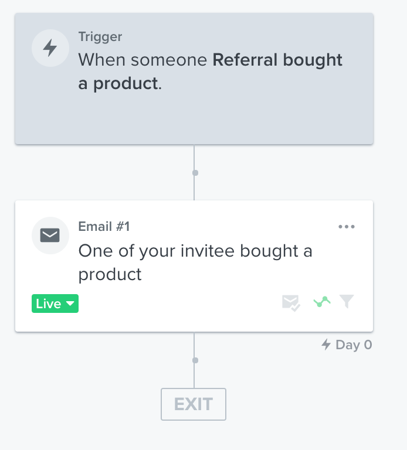
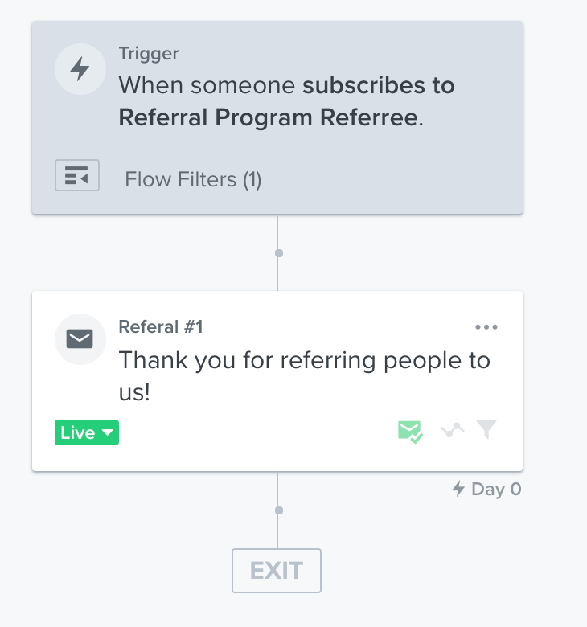
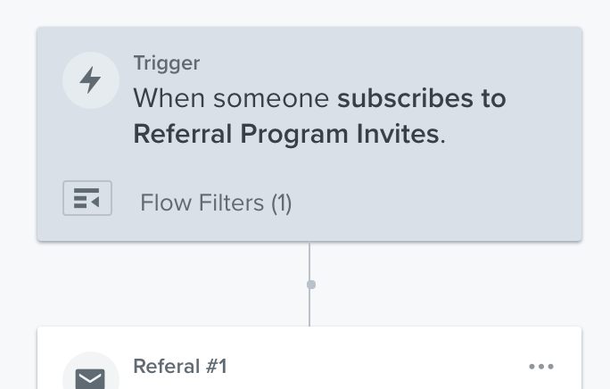

# Referral program Rest API for Shopify and Klaviyo

This Express-js API written typescript communicates with shopify API and Klaviyo API to create discount code when somebody subscribes to the program. It allows send invites to customers with a special coupon code via Klaviyo. When somebody places an order there is a flow created in Klaviyo and in the application that send the referee his own coupon code.
Coupon code values can be customized.

*Requirements: Shopify shop and Klaviyo account.*

**Definition:** *Referee is the person that refers other people, refered is the person that is refered by the referee*

Detais:
* Server will be running on :3000.
* Examinator is running every hour to check for new orders in Shopify and see if any new orders used a referral code so it can then send the referee his discount code as well.
* 3 Worklow needs to be configured in Klaviyo to send email. You get full control about the email that are send. See [klaviyo configuration](#config-klaviyo) for more details.


## Instalation

Setup [TypeScript](https://www.freecodecamp.org/news/how-to-set-up-a-typescript-project-67b427114884/) environment then run:
```
  npm install
```

## Configuration

* Update `src/const.ts` with your shopify store credentials, klaviyo api keys.
Create a private app to get api key with [Shopify](https://shopify.dev/tutorials/authenticate-a-private-app-with-shopify-admin)
Get your account api key with [Klaviyo](https://help.klaviyo.com/hc/en-us/articles/115005062267-Manage-Your-Account-s-API-Keys)
* Update the timer when you want to examine the orders in shopify to see for new orders. If you get lots of orders you could update it to 4 hours.
* Update your coupon details for referee and refered with percent or fixed amount.
* Setup Klaviyo
* Update list ids and event name


## <a name="config-klaviyo"></a>Klaviyo Setup

Setup 3 workflows and 2 lists as follows needs to be setup in Klaviyo as well. You get control over the email style that are send.

The event name *'Referral bought a product'* can be updated in `src/const.ts`.
It has to be the exact same name in klaviyo in the trigger event name.

1. Create two list in klaviyo for the referee and the refered.
  Note the list id and update `src/const.ts` accordingly. That is where people will be added.
<br/>
2. Referee gets compensated. Setup a workflow similar to this one.

<br/>
3. Referee gets confirmation email after refering new persons.
   The list name is the one you created before for the referee person.

<br/>
4. Refered get his email with the name of the person that refered him and his coupon code.
   The list name is the one you created before for the refered person.

<br/>

## test environment

Run with:
```
  npm run start
```

## deployment on a live server

* Setup with [nginx](https://www.digitalocean.com/community/tutorials/how-to-set-up-a-node-js-application-for-production-on-ubuntu-16-04) or Setup with [apache](https://www.ionos.com/community/server-cloud-infrastructure/nodejs/set-up-a-nodejs-app-for-a-website-with-apache-on-ubuntu-1604/)
* Fork the repository and create a release branch.
* Use this branch to setup on your server